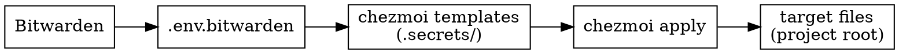

# secrets-sync

All chezmoi commands in this repo require `--config ./.chezmoi.toml` because the config is project-local, not in `~/.config/chezmoi`.

## Source-of-Truth Chain

## Quick Reference

| Operation | Command |
|---|---|
| Add new secret | `./dotfile-utils/scripts/chezmoi-add-secret.sh [--encrypt] <path>` |
| Edit existing secret | Edit file in place, then `chezmoi --config ./.chezmoi.toml merge <path>` to sync back to source |
| List managed files | `chezmoi --config ./.chezmoi.toml managed` |
| Apply secrets | `chezmoi --config ./.chezmoi.toml apply` |
| Check diff | `chezmoi --config ./.chezmoi.toml diff` |
| Source Bitwarden | `source ./dotfile-utils/scripts/source_bitwarden_session.sh` |
| Stage in submodule | `chezmoi --config ./.chezmoi.toml git -- add <chezmoi-path>` |

## Workflow

1. Determine operation: add / edit / list / apply
2. If working with encrypted or Bitwarden-templated secrets, source the Bitwarden session first (auto-sourced by helper script when `.env.bitwarden` exists or `BW_SESSION` is set)
3. Run the correct command from the table above
4. Verify with `managed` or `diff`
5. Stage changes inside `.secrets` submodule
6. **Remind user** to commit the updated submodule pointer in the parent repo

## Key Facts

- **Config flag required:** Every `chezmoi` invocation needs `--config ./.chezmoi.toml`
- **GPG key ID:** `9A4ABBA2F90BCF19`
- **`.secrets` is a git submodule** -- changing files inside it means the parent repo sees a dirty submodule pointer that must also be committed
- **`chezmoi-add-secret.sh`** handles dot-prefix conversion (`.env` -> `dot_env`) and `encrypted_` prefix automatically; it also auto-sources Bitwarden if `.env.bitwarden` exists
- **Source dir:** `.secrets/` (set via `sourceDir` in `.chezmoi.toml`)
- **Dest dir:** project root `.` (set via `destDir` in `.chezmoi.toml`)

## Common Mistakes

- Running bare `chezmoi` without `--config ./.chezmoi.toml` (will use `~/.config/chezmoi` and operate on the wrong source)
- Forgetting to commit the submodule pointer in the parent repo after changing `.secrets`
- Using `chezmoi add` directly instead of `chezmoi-add-secret.sh` for project files (chezmoi refuses to add files from its own dest dir)
